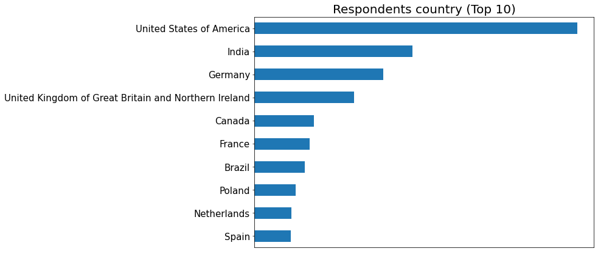
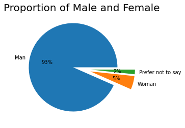
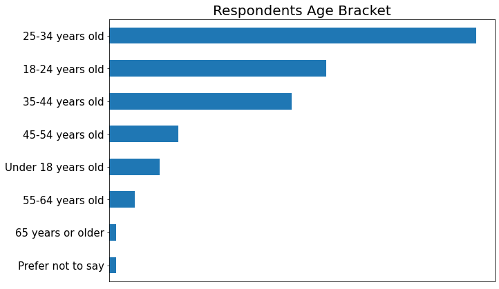
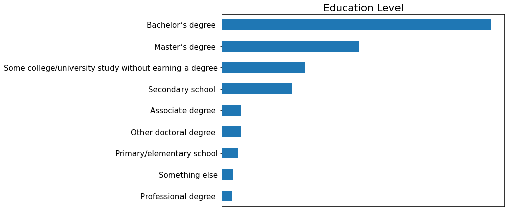
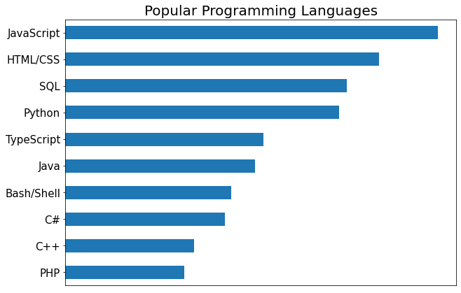
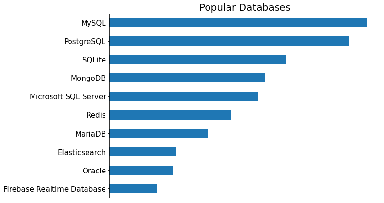
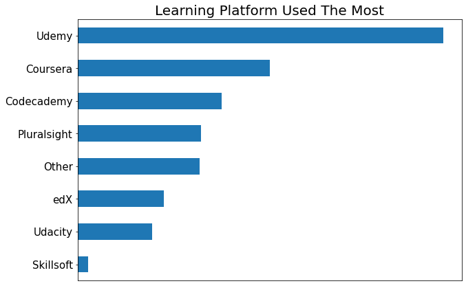

# StackOverflow_Developers_Survey_2022

## ***Insights into the 2022 StackOverflow developers survey***

 

## [Technical Report](https://medium.com/@AviatorIfeanyi/an-analysis-of-stack-overflow-2022-developers-survey-e268065f3b7c)

 

### The 2022 Stack Overflow survey aims to gather insights on the current state of the software development industry, including the technologies and tools being used, the challenges developers face, and the demographics of the developer community. The survey is conducted online, and is open to all developers who use StackOverflow.

 

### The survey includes a mix of multiple choice and open-ended questions, covering a range of topics including:

    Technologies and tools being used by developers
    Challenges faced by developers in their work
    Demographics of the developer community (e.g. age, gender, education, etc.)
    Job satisfaction and career goals
    Work environment and culture

 

## Insights

 

### Looking at the demographics of the respondents, a greater number of developers where from the United States of America, while the rest wer spread across India, Germany etc

 

## Gender Representation
 

### The majority of respondents were male, with little female representation. 

 

## Age Group
 

### The age of respondants were evenly spread, with the largest group being in the range of 18 - 35

 

## Education
 

### Most of the respondants identified having a degree, bachelors and masters degree being the most acquired

 

## Programming Language
 

### JavaScript remained the most popular language among developers. Python, SQL, HTML/CSS were also among the most widely used language

 

## Database
 

### MySQL, PostgreSQL and Sqlite relational database were the top identified database used by developers. In the non-relational database category, Mongodb was most used.

 

## Learning Platforms
 

### Developers are learners and always in constant quest to update their knowledge. These were the learning platforms which were identified by developers which they used in learning and upskilling

 

## Conclusion

### Overall, the goal of the 2022 Stack Overflow survey is to provide a comprehensive and up-to-date picture of the software development industry, and to help developers, employers, and policymakers better understand the needs and concerns of the developer community.